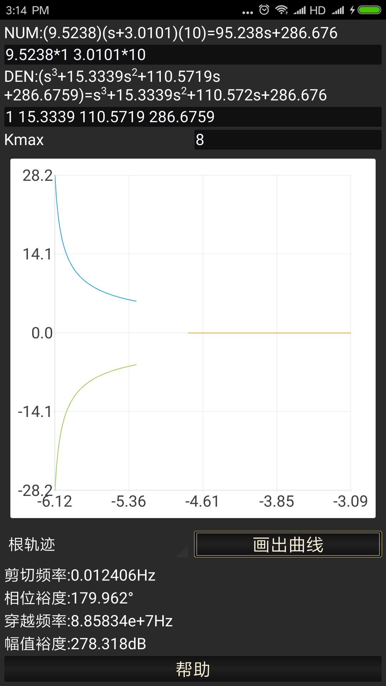
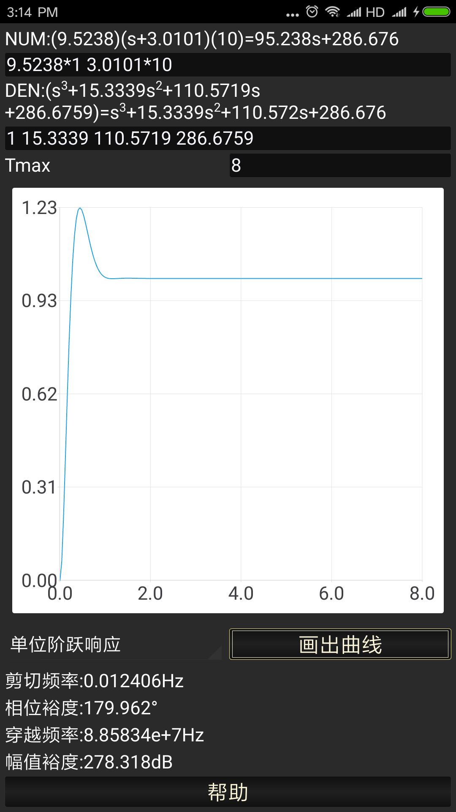
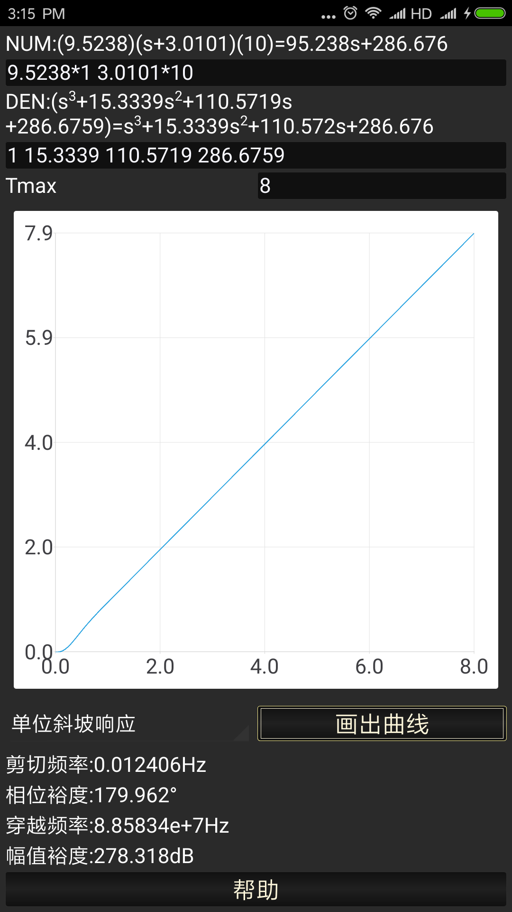

# 用户指南

### 使用方法
使用方法非常简单，与电脑上使用MATLAB的方法并无太大区别。对于一个线性系统，需要输入它传递
函数分子与分母的多项式。多项式输入支持多个多项式相乘的形式。例如，如果需要输入的多项式是 
(s2+2s+3)(-3s+1)(2s-1)(2s2-s), 那么只需要输入
 "1 2 3 * -3 1 * 2,-1*2,-1 0"(*是各个相乘多项式之间的分隔符, 而空白和英文逗号可以作为多项式中各个系数
 之间的分隔符)。接着在下拉菜单中选择需要绘制的图形类别，单击“画出曲线”按钮，即可绘制曲线，并计算相位裕度等信息。

### 截屏示例

 

 

 

